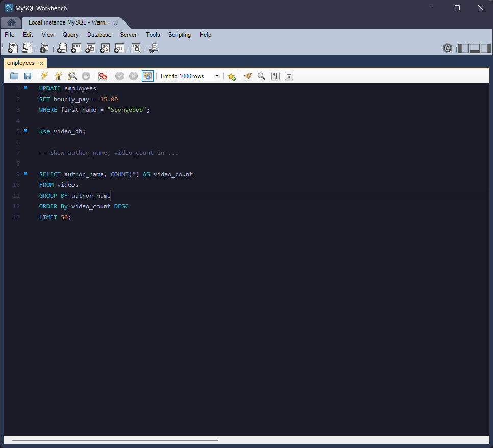

### [MySQL Workbench](https://www.mysql.com/products/workbench/)

#### Screenshot
> A dark theme for [MySQL Workbench](https://www.mysql.com/products/workbench/)

#### Install using Git

If you are a git user, you can install the theme and keep up to date by cloning the repo:

    git clone https://github.com/mino29/mysql-workbench-tokyonight.git

#### Install manually

Download using the [GitHub .zip download](https://github.com/mino29/mysql-workbench-tokyonight/archive/refs/heads/main.zip) option and unzip them.

#### Activating theme

**Using Windows**

1. Copy `code_editor.xml` file
2. Go to `C:\Program Files\MySQL\MySQL Workbench 6.3 CE\data` or `C:\Users\YOUR_USERNAME\scoop\mysql-workbench\current\data` if you are a fellow scoop enjoyer
3. Copy `code_editor.xml` and overwrite the existing one in the directory
5. Open your MySQL Workbench and be happy!

**Using Ubuntu**

1. Copy the code from the `copy.xml` file
2. Go to `/usr/share/mysql-workbench/data`
3. Open `code_editor.xml`
4. Paste the code you've selected before inside the tag `<language name="SCLEX_MYSQL">`, replacing all styles in that tag
5. Open your MySQL Workbench and be happy!

**Using Mac**

1. Copy the code from the `copy.xml` file
2. Go to `/Applications/MySQLWorkbench.app/Contents/Resources/data/code_editor.xml` (to open the contents of the app right click on the workbench app and select 'Show Package Contents')
3. Open `code_editor.xml`
4. Paste the code you've selected before inside the tag `<language name="SCLEX_MYSQL">`, replacing all styles in that tag
5. Open your MySQL Workbench and be happy!

#### Credit

[Dracula MySQL](https://github.com/dracula/mysql-workbench)

I basically just copy the dracula one and tweak the colors to my liking, I like tokyonight a lot.
